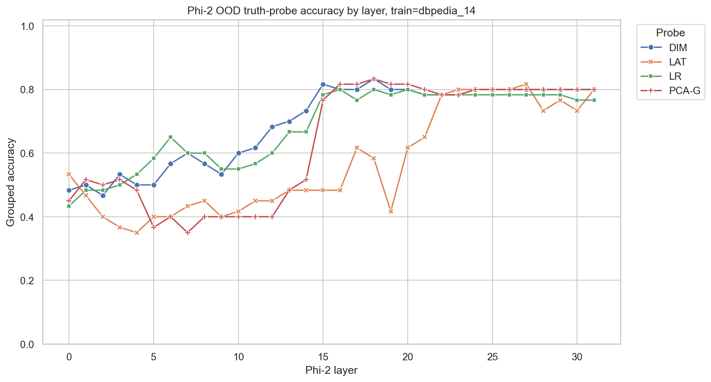
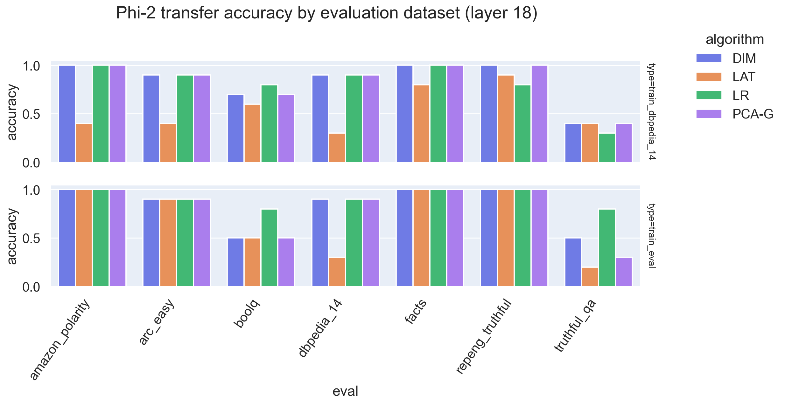
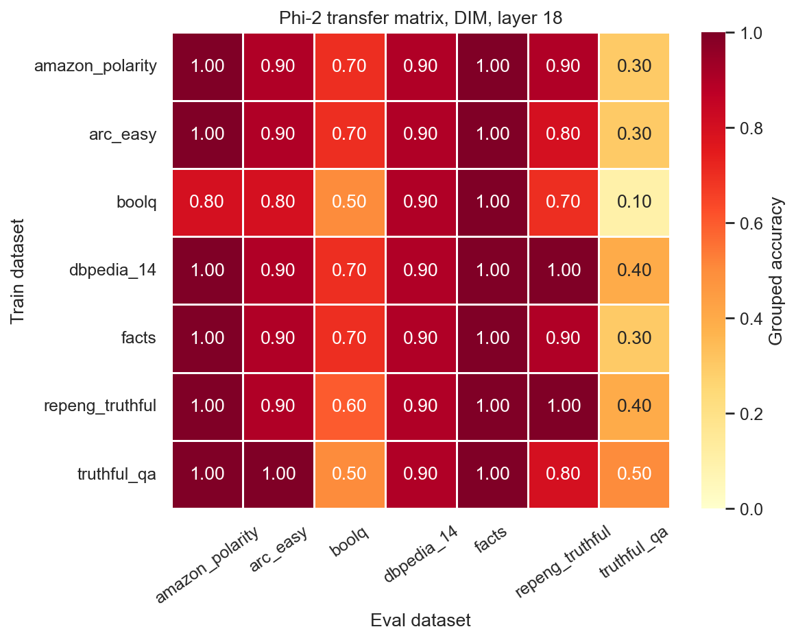

# Lie Detector for LLMs — Phi-2 Truth-Probe Generalisation


> A reproduction and small-model stress-test of the *"How well do truth probes generalise?"* study — applied to **Microsoft Phi-2 (2.7B)** instead of Llama-2-13B.

---

## Academic Context

This project was realised as part of the course **PROJ-H402 — Computing Project (2025/2026)**, first year of the Master in Computer Science and Engineering. It represents a **120–150 h workload (5 ECTS)** simulating real-world software/research production for a faculty customer.

The work follows the original LessWrong post and reference implementation:

- Paper / blog: [*How well do truth probes generalise?* — Wagner et al.](https://www.lesswrong.com/posts/cmicXAAEuPGqcs9jw)
- Reference repository: [`mishajw/repeng`](https://github.com/mishajw/repeng)

---

## Abstract

Representation Engineering (RepEng) literature has shown that large language models such as **Llama-2-13B** encode a *linearly separable "truth direction"* in their hidden states, which generalises out-of-distribution (OOD) across many datasets. Whether this property is **an emergent consequence of model scale** or **a structural property of the Transformer architecture itself** remains an open question.

This project addresses that question by reproducing the original generalisation protocol on a **5× smaller base model — Microsoft Phi-2 (2.7B)** — using a strict, single-template prompt pipeline. We extract last-token hidden states across 14 standardised datasets, train four families of linear probes (**DIM, LR, PCA-G, LAT**), and measure transfer accuracy on held-out datasets at every Transformer layer (0 → 31).

We find that the truth direction **does generalise on Phi-2**, with only a ~10 percentage-point quantitative gap relative to Llama-2-13B, supporting the architectural-property hypothesis.

---

## Research Question

> Does Phi-2 contain a reusable linear "truth direction" that transfers across datasets, or are truth probes mostly dataset-specific on a smaller model?

---

## Pipeline & Methodology

### 1. Dataset Preparation

- **14 datasets** were ingested: 12 from the Hugging Face Hub and 2 local sources.
- A unified **contrastive grouping** schema is applied: each example forms a `group_id` containing at least one *true* and one *false* candidate sharing the same context — this prevents context-level data leakage across train/validation/test splits.
- Every (question, answer) pair is wrapped in a **single, declarative prompt template** (defined once in [`datasets.py`](src/lie_detector_llm/datasets.py#L27-L32)):

```text
Task: Decide whether the candidate answer is correct.

Question:
{question}

Candidate answer:
{answer}

Correctness:
```

Phi-2 is a *base* (non-chat) model; no system/user/assistant role markers are used.

#### Dataset sources

| # | Dataset | Source | Type |
|---|---|---|---|
| 1 | `imdb` | `stanfordnlp/imdb` | Binary sentiment |
| 2 | `amazon_polarity` | `fancyzhx/amazon_polarity` | Binary sentiment |
| 3 | `ag_news` | `fancyzhx/ag_news` | 4-way topic classification |
| 4 | `dbpedia_14` | `fancyzhx/dbpedia_14` | 14-way topic classification |
| 5 | `rte` | `nyu-mll/glue` (config `rte`) | Textual entailment |
| 6 | `boolq` | `google/boolq` | Boolean QA |
| 7 | `arc_easy` | `allenai/ai2_arc` (`ARC-Easy`) | Science QA |
| 8 | `arc_challenge` | `allenai/ai2_arc` (`ARC-Challenge`) | Science QA |
| 9 | `openbookqa` | `allenai/openbookqa` (`main`) | Science QA |
| 10 | `commonsense_qa` | `tau/commonsense_qa` | Commonsense QA |
| 11 | `piqa` | `ybisk/piqa` | Physical reasoning |
| 12 | `truthful_qa` | `truthfulqa/truthful_qa` (`multiple_choice`) | Misconception/adversarial QA |
| 13 | `facts` | Local — GoT-style factual contrasts | Built in-memory |
| 14 | `repeng_truthful` | Local JSONL from the `repeng` repo | Honest/dishonest self-reports |

### 2. Activation Extraction

- A single forward pass of `microsoft/phi-2` is performed per prompt with `output_hidden_states=True`.
- The hidden state at the **last real token** ("Correctness:") is extracted at every layer (0–31).
- Tensors are cached on disk (`data/activations/`) to amortise the cost across all downstream experiments.

### 3. Probe Training

Four linear probe families are evaluated:

| Method | Name | Supervision | Idea |
|---|---|---|---|
| `dim` | Difference-in-Means | Supervised | Direction = mean(true) − mean(false). |
| `lr` | Logistic Regression | Supervised | L2-regularised linear classifier on hidden states. |
| `lat` | Linear Artificial Tomography | Weakly supervised (orientation only) | PCA on random pairwise activation differences. |
| `pca-g` | Grouped PCA | Weakly supervised (orientation only) | First principal component after per-group centring. |

### 4. Evaluation Protocol

- **Strict train / validation / test split at the group level** (60 / 20 / 20) — prevents candidates of the same question from leaking across splits.
- **Grouped accuracy** is used as the headline metric (a question counts as correct only if the probe ranks its true candidates above its false candidates).
- **Out-of-Distribution (OOD) transfer**: a probe is trained on one source dataset and evaluated on all other datasets to produce a full 7 × 7 transfer matrix.

---

## Key Findings

### Finding 1 — The truth direction emerges at ~50 % of network depth



Across all four probe families, OOD grouped accuracy stays near chance (~0.50) for layers 0 → 14, then undergoes a **sharp transition around layer 15** and plateaus at **~0.78 – 0.80** for the remainder of the network (layers 16 → 31).

| Stage | Layer range | OOD accuracy |
|---|---|---|
| Early — uninformative | 0 – 14 | ≈ 0.40 – 0.55 |
| Transition | 15 – 16 | 0.55 → 0.80 |
| Plateau — "truth crystallised" | 17 – 31 | 0.78 – 0.80 |

**Comparison with Llama-2-13B.** The original study reports emergence around layers 12–14 of 40 (~30–35 % depth). On Phi-2 the emergence is at **~50 % relative depth**, suggesting that smaller models compress factual information later in their stack, while preserving the same qualitative phase transition.

### Finding 2 — DIM is the strongest OOD generaliser



Mean off-diagonal transfer accuracy at layer 18 — i.e. the average accuracy of a probe trained on one dataset and evaluated on a *different* dataset:

| Probe | Mean OOD transfer | Notes |
|---|---|---|
| **DIM** | **0.79** | Most robust; insensitive to intra-class covariance, hence to dataset-specific spurious correlations. |
| **LR** | 0.76 | Slight overfitting to source-dataset boundaries. |
| **PCA-G** | 0.73 | Competitive despite being only weakly supervised. |
| **LAT** | 0.70 | Most unstable across layers (visible dip to 0.42 at layer 19). |

This ordering is **fully consistent** with the original Llama-2-13B study, which also reports DIM as the most reliable OOD probe.

### Finding 3 — TruthfulQA behaves as an outlier, by construction



The 7 × 7 DIM transfer matrix is densely red (accuracy ≥ 0.80) on most off-diagonal cells, with **one systematic exception: the `truthful_qa` column** drops to **0.10 – 0.50** across all source datasets.

- Reading **rows**: training on `truthful_qa` and evaluating elsewhere yields 0.50–1.00 → the dataset *transfers out* normally.
- Reading the **column**: training elsewhere and evaluating on `truthful_qa` collapses to 0.10–0.50.

This is **not a Phi-2 weakness** — it reproduces a well-documented property of TruthfulQA itself, which is *adversarially constructed* to elicit common human misconceptions rather than test factual recall. A probe that transferred *well* to TruthfulQA would in fact be suspicious.

### Synthesis

| Property | Llama-2-13B (paper) | Phi-2 (this study) | Verdict |
|---|---|---|---|
| OOD plateau accuracy | ~0.88 – 0.92 | ~0.78 – 0.80 | −10 pp, attributable to 5× smaller model |
| Emergence depth (relative) | ~30–35 % | ~47–56 % | Shifted later, but same shape |
| Best probe family | DIM ≈ LR > PCA > CCS / LAT | DIM > LR > PCA-G > LAT | Identical ordering |
| TruthfulQA as outlier | Yes | Yes | Identical |

**Conclusion.** The linear truth direction is **resilient at smaller scale**. Its existence appears to be a *structural* property of the Transformer architecture rather than a phenomenon that requires ≥ 13B parameters to manifest.

---

## Repository Structure

```
.
├── src/lie_detector_llm/
│   ├── datasets.py      # Dataset loaders, contrastive grouping, prompt template
│   ├── models.py        # Phi-2 loading and last-token activation extraction
│   ├── probes.py        # DIM, LR, PCA-G, LAT probe implementations
│   ├── experiment.py    # Single-probe, transfer, layer-sweep, matrix runners
│   └── plotting.py      # Seaborn/matplotlib figures
├── notebooks/
│   ├── 01_method_overview.ipynb
│   ├── 02_train_a_probe.ipynb
│   ├── 03_generalization_study.ipynb
│   ├── 04_layer_sweep.ipynb
│   └── 05_full_transfer_matrix.ipynb
├── results/             # CSVs and figures (regenerated by run_experiment.py)
├── data/activations/    # Cached Phi-2 hidden states
├── run_experiment.py    # End-to-end pipeline
├── pyproject.toml
└── requirements.txt
```

---

## Installation

```bash
python3 -m pip install -r requirements.txt
python3 -m pip install -e .
```

Phi-2 is a public Hugging Face checkpoint. If your environment requires authentication, set an `HF_TOKEN` environment variable (or place it in a `.env` file at the repository root).

---

## Usage

### Run the full pipeline

```bash
python3 run_experiment.py
```

The script writes CSVs and figures to `results/`, and caches activation tensors under `data/activations/`. The cache is important: Phi-2 forward passes are the dominant cost — once activations are extracted, probe training is essentially free.

### Notebook workflow

The notebooks reproduce the report figures step by step:

1. [`01_method_overview.ipynb`](notebooks/01_method_overview.ipynb) — high-level method overview.
2. [`02_train_a_probe.ipynb`](notebooks/02_train_a_probe.ipynb) — train one probe on one dataset.
3. [`03_generalization_study.ipynb`](notebooks/03_generalization_study.ipynb) — train on one dataset, evaluate on all others.
4. [`04_layer_sweep.ipynb`](notebooks/04_layer_sweep.ipynb) — accuracy as a function of Phi-2 layer.
5. [`05_full_transfer_matrix.ipynb`](notebooks/05_full_transfer_matrix.ipynb) — full train × eval transfer heatmap.

---

## Acknowledgments

- This project is inspired by [`mishajw/repeng`](https://github.com/mishajw/repeng) and the broader **Representation Engineering** line of research on probing high-level concepts in Transformer hidden states.
- The reference study — [*How well do truth probes generalise?*](https://www.lesswrong.com/posts/cmicXAAEuPGqcs9jw) — provided the experimental protocol that this work adapts to Phi-2.
- Realised within **PROJ-H402 — Computing Project (2025/2026)**, Master in Computer Science and Engineering.
