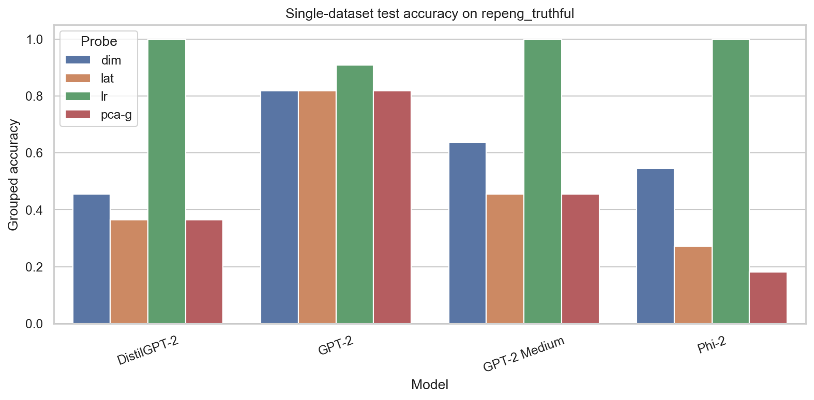
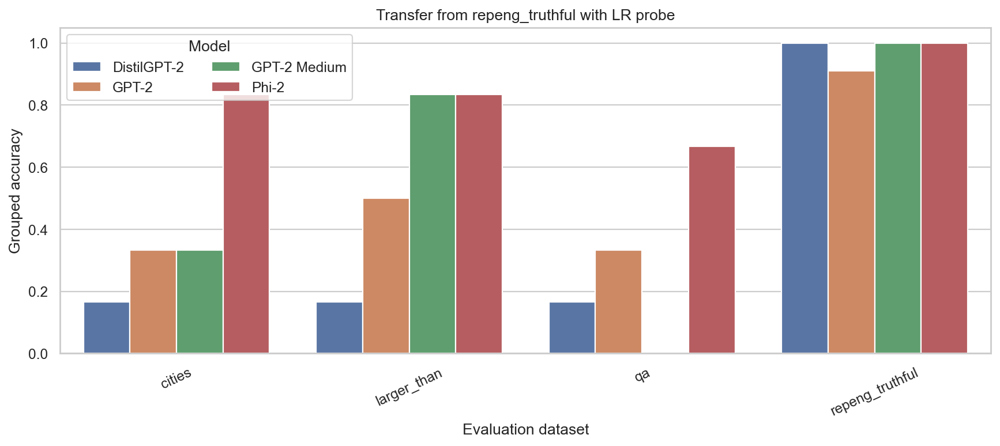
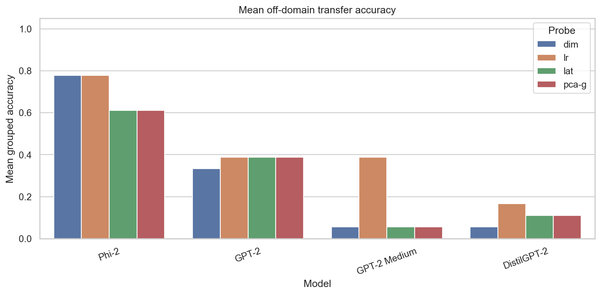
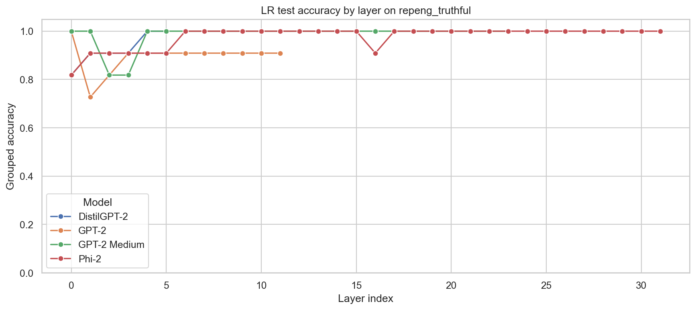
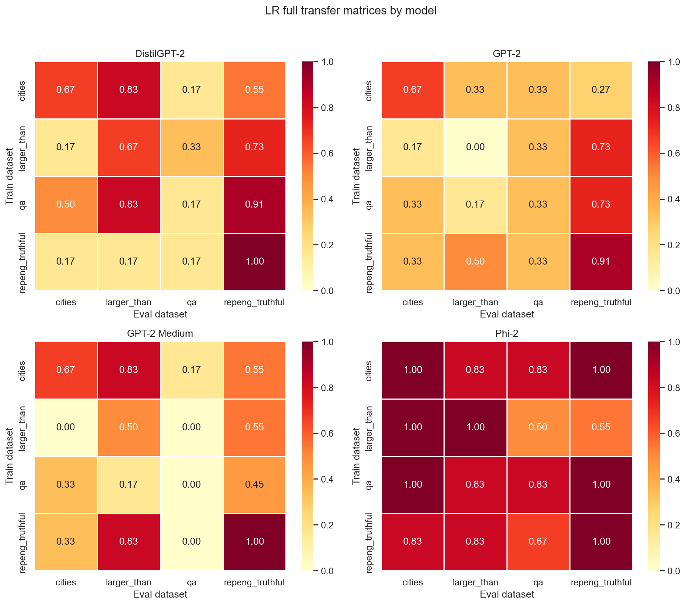

# Local Model Comparison Report

This report summarizes the local comparison run produced by:

```bash
.venv/bin/python run_local_model_comparison.py
```

The run mirrors notebooks 2 to 5 across four models that are feasible on the local
machine: DistilGPT-2, GPT-2, GPT-2 Medium, and Phi-2. Larger models such as Llama 3
8B/70B should be run with the Colab notebook because they need more GPU memory than
this local setup provides.

## What the Experiment Tests

The project asks whether truthfulness is visible in an LLM's hidden states. For each
question and candidate answer, the code:

1. builds grouped true/false candidate-answer examples,
2. runs the LLM in white-box mode without generating text,
3. extracts the hidden state at the final prompt token,
4. trains a linear probe to score true answers above false answers,
5. evaluates grouped accuracy inside each question group,
6. repeats the analysis across probe methods, datasets, layers, and models.

## Local Model Summary

| Model | HF model | LR test accuracy on repeng_truthful | Mean LR off-domain transfer | Best LR test layer | Mean LR matrix off-diagonal |
|---|---|---:|---:|---:|---:|
| Phi-2 | `microsoft/phi-2` | 1.000 | 0.778 | 31 | 0.823 |
| GPT-2 | `gpt2` | 0.909 | 0.389 | 0 | 0.380 |
| GPT-2 Medium | `gpt2-medium` | 1.000 | 0.389 | 23 | 0.351 |
| DistilGPT-2 | `distilgpt2` | 1.000 | 0.167 | 5 | 0.460 |

Main interpretation: all four local models can overfit or solve the small
`repeng_truthful` test split with an LR probe, but Phi-2 transfers much better to the
other datasets. This makes Phi-2 the strongest local baseline in this repository.

## Key Figures











## Replication Status Versus `mishajw/repeng`

This repository reproduces the core research idea and experimental shape of
`mishajw/repeng`: extract activations, train linear representation probes, evaluate
grouped truth accuracy, compare transfer across datasets, and inspect layer effects.

It is not yet a full paper-level reproduction of the original repository. The original
comparison uses a much larger activation dataset, many more source datasets, more probe
families, and `Llama-2-13b-chat-hf` over many hidden layers. This local run uses a small
course-friendly dataset collection and local models. The Colab notebook should be used
for the professor's requested large-model comparison.

## Output Files

- `local_model_summary.csv`: one-row summary per model.
- `single_probe_results.csv`: notebook 2 style probe-method comparison.
- `transfer_from_repeng_results.csv`: notebook 3 style transfer from `repeng_truthful`.
- `layer_sweep_lr_results.csv`: notebook 4 style LR layer sweep.
- `full_transfer_matrix_lr_results.csv`: notebook 5 style train/eval transfer matrix.
- `*.png`: generated comparison plots.
